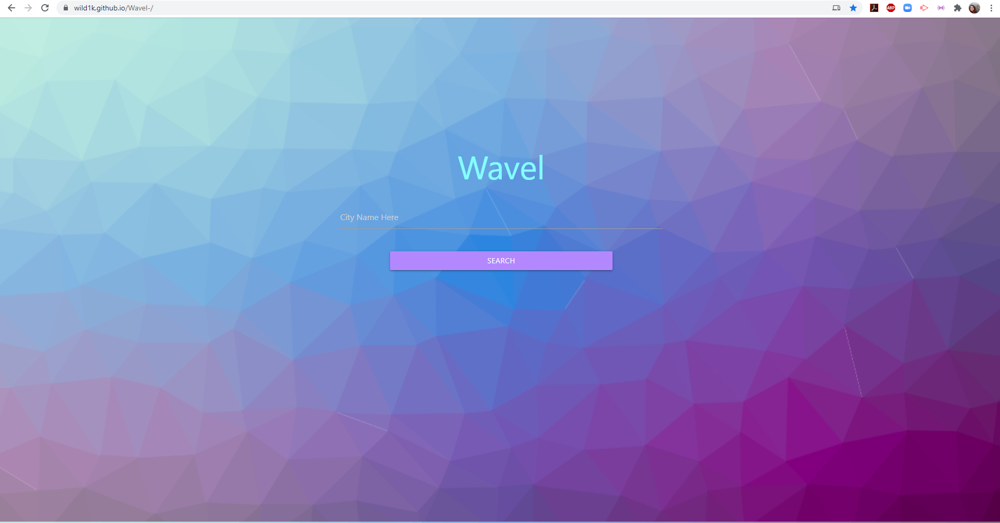
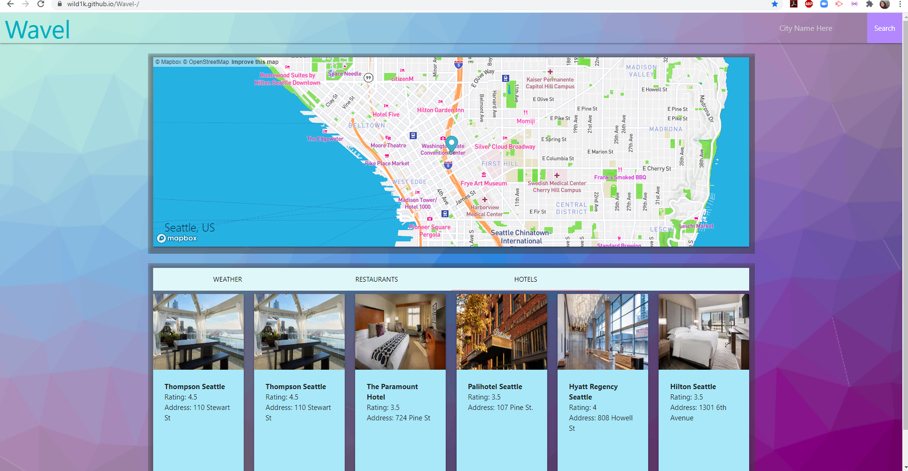
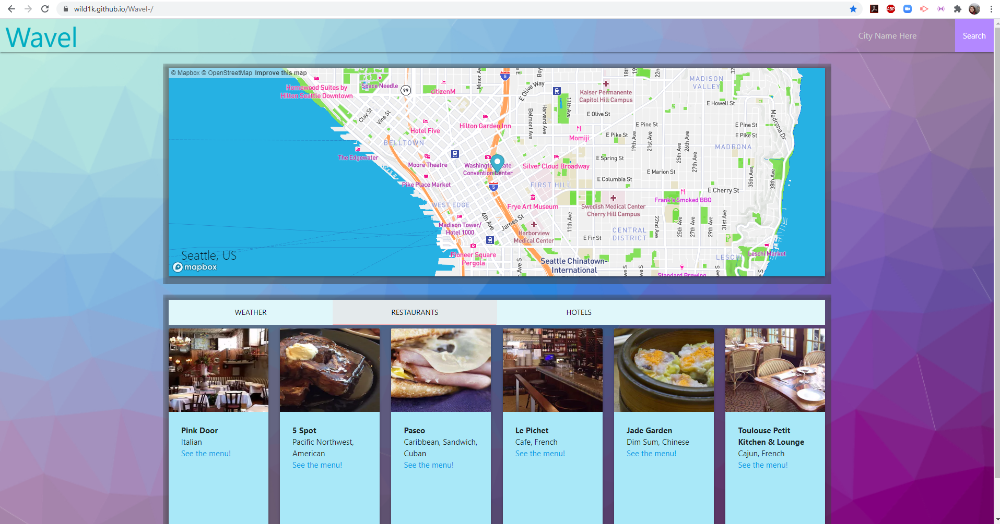
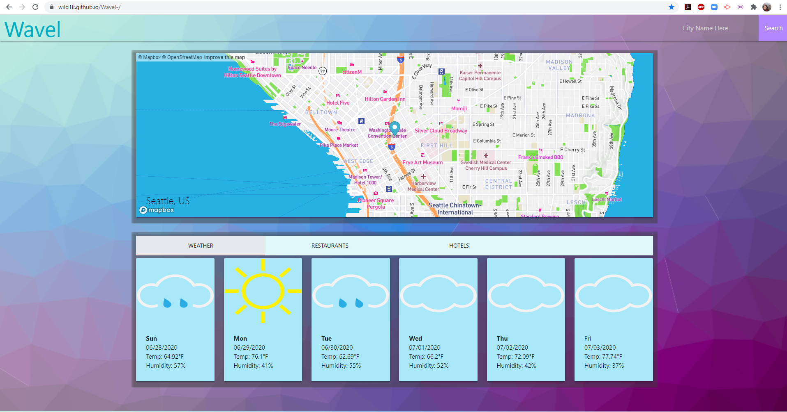
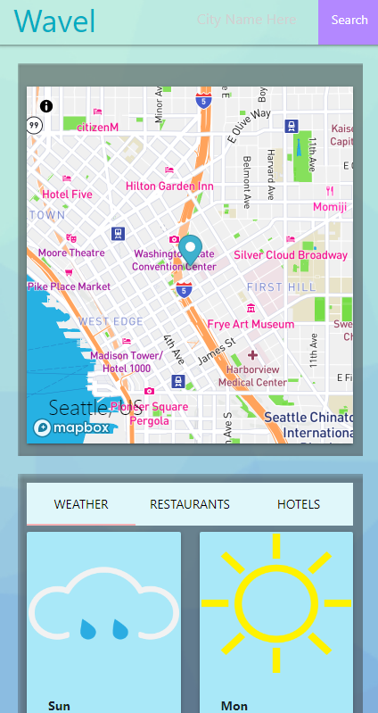

# Wavel-
AS A user who wants to casually research a city I'd like to travel to
I WANT an app that allows me to plan a trip with minimal effort
I WANT to be presented with a home screen where I can enter my search query on page load
I WANT to see a map of the area I've searched for
I WANT to see the weather forecast for the next six days
I WANT to see highly rated restaurants in that city
I WANT to see hotels with rooms available during my travel window

Check out our live app at https://wild1k.github.io/Wavel-/
https://github.com/wild1k/Wavel-

For this app, we sourced multiple APIs to meet these goals.
We used openweathermap's API to grab coordinate data and to create a six day forecast.
We used mapbox's API to grab an interactive map of the user-queried area using the coordinates generated by openweathermap.
We used zomato's API to find highly rated restaurants near those generated coordinates.
We used RapidAPI's hotels API to find hotels with available rooms near those generated coordinates.
We used Materialize for our layout formatting.

Thanks to those at https://www.dovora.com/resources/weather-icons/ for the use of their weather icons

